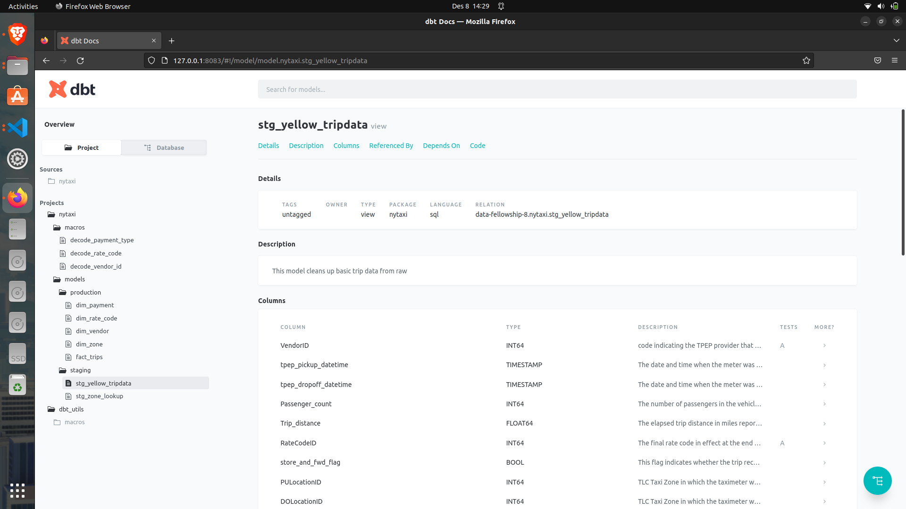

# 04-dbt-analyticial-engineering

## Problem Statement
Create a dbt transformation process for 2019 yellow trip data from raw data source, to staging data, to
data warehouse (dimension and fact model), and explain what data quality test you did.

Bonus if you also create the dbt documentation.

## Data Source
https://www.kaggle.com/datasets/microize/newyork-yellow-taxi-trip-data-2020-2019?resource=download

## Docs

### Run Docs
dbt docs generate

dbt docs serve --port 8083
